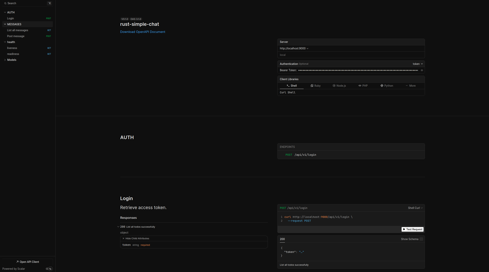

# Rust Axum and Postgresql - microservice example

Backend stack using Rust , including interactive API documentation and many useful features out of the box.

**Full list what has been used:**

[TODO]

### Interactive API documentation

## How to use it

[TODO]

## Environment variables

[TODO]

## How to deploy

[TODO]